# The Qwadro Execution Ecosystem
The **Qwadro** is a free and open-source software (FOSS), ISO C17 open standard, low-level data-oriented, federated execution ecosystem that offers a set of acceleration building blocks to edify system softwares targeting firstly computer simulation, interactive entertainment and multimedia user experience. Qwadro constitutes a unified infrastructure of and for middlewares, libraries, drivers and engines, continuously integrated, providing resources, devices, services and abstracting operating systems and platforms in a straightforwared uniform way. It is released as open source under the Qwadro License.

## Proposal

Unifying the future of software engineering (and/or just another API).

In the ever-evolving world of technology, multimedia experiences are becoming an integral part of our daily lives. From immersive gaming to high-definition video streaming, seamless interaction between hardware components and software systems is critical. Today, we stand at the threshold of a new era in multimedia development—an era where hardware-accelerated I/O, graphics, sound, audio, video, and user interactions are seamlessly integrated into a single, unified platform.

### The Challenge: A Fragmented Multimedia Landscape

Currently, developers face the challenge of managing multiple disparate APIs across different hardware components and platforms. From handling complex graphical rendering with GPU acceleration to synchronizing high-quality audio and video streams, the ecosystem is fragmented. This disjointed approach results in inefficiencies, increased development time, and a lack of cohesion between multimedia technologies.

### The Vision: One Unified API for All Basic Multimedia Needs

We propose the creation of a Unified Multimedia API that will consolidate hardware-accelerated I/O, graphics, sound, audio, video, multimedia mixing, and user interactions into a single, streamlined interface. By unifying these critical components, this new API will empower developers to create more powerful, efficient, and immersive multimedia applications across all devices and platforms.

### Key Features of the Unified API:

* Hardware-Accelerated I/O: The API will leverage hardware acceleration for input and output, ensuring that data transfers and device communication are faster and more efficient. This will reduce latency, optimize performance, and deliver real-time processing for multimedia applications.

* Graphics and Visuals: With native support for advanced graphics technologies like GPU acceleration, ray tracing, and high-performance rendering, the API will enable developers to create visually stunning applications with minimal overhead.

* Sound and Audio Integration: By providing a unified framework for both 3D sound spatialization and high-fidelity audio playback, the API will simplify the development of immersive sound experiences—whether it's for video games, virtual reality, or media production.

* Video and Multimedia Mixing: Seamlessly integrate video playback, live-streaming, and multimedia mixing. The API will allow real-time video encoding, decoding, and manipulation, making it perfect for everything from video conferencing to professional media editing.

* Intuitive Shell and User Interface Experience: Simplifying the way users interact with multimedia applications, the unified API will provide streamlined interfaces and responsive feedback, whether through touch, voice, or traditional input methods.

* Cross-Platform Support: The API will be designed to work across a wide variety of devices, operating systems, and hardware configurations, ensuring that developers can build for any platform without worrying about compatibility issues.

* Efficient Development Tools and Documentation: We’ll provide comprehensive documentation and development tools that allow developers to quickly harness the power of this unified API. With detailed guides, sample projects, and community-driven support, developers can accelerate their productivity and innovation.

### The Benefits:

* Faster Development Cycles: By using a single, unified API, developers can focus on creating features rather than managing multiple, complex systems.
* Improved Performance: With hardware acceleration for graphics, sound, video, and I/O, applications will run faster and more efficiently, providing a smoother experience for end-users.
* Enhanced User Experience: Users will enjoy more seamless and immersive multimedia experiences, whether they’re gaming, watching videos, or interacting with multimedia applications.
* Greater Accessibility: A unified approach makes advanced multimedia technology accessible to a wider range of developers, including those who may not have deep experience with specific hardware or multimedia platforms.

Join us in building a future of computer-centric user experience. This unified API will is designed to change how we make interactive software across the PC realm.

Are you a developer, hardware manufacturer, or tech enthusiast? Let's work together to build an API that bridges the gap between hardware and software, enhancing multimedia experiences for all. Get involved, contribute ideas, and become part of this generation of multimedia experience.

## Introduction

This project represents the work of a group of software engineers and application developers meeting as the **Qwadro Working Group** (**4DWG**) of the **SIGMA Technology Group**, a arm of the **SIGMA FEDERATION**, the federation of independent cyber science, technology and engineering societies from Latin America. The goal of this group is to influence, foster, viabilize and improve the genuine development of multimedia user experience applications, hardware-accelerated high-performance optimal softwares and optimal entertainment softwares in the areas of 2D, 3D and 4D simulations and its renderization for the Latin American audience.
This project defines the expectations of the group with regards to current acceptable 4D simulation and rendering functionality, and is an extension to the work done by Veryzon known as **Quadridimensional World Approximation**.

The API concept and specification proposed in this project were primarily contributed by Veryzon. They were drafted in large part by Veryzon and owe much in their form and format to Veryzon's essays around experimental 4D technologies. The Working Group process provided advice, comments, guidance and suggestions for additions to these guidelines, which were contributed by software developers with battle-tested experiences working with hardware and software vendors and application developers and enthusiasts, indie game developers and enthusiasts, game modding communities and enthusiasts.

The **SIGMA FEDERATION** and all members shall not be held liable to any person or entity for any reason related to the adoption or implementation of, nor adherence to the recommendations in, nor any other use of this project nor any accompanying software.

The codebase prefix in early days was ***QW*** but actually, to reduce confusion, it is ***AFX***, which was inherited of Qwadro Acceleration Frameworks, the standard Qwadro implementation. There are other prefixes for other partitions (***AVX***, ***AEX***, ***AAX***, ***AMX***, ***AUX***, ***ATX***, etc). The SIGMA reserves for itself and its experiments QW and every possible prefix A\*X for future components and expansions of the Qwadro.

In Qwadro, a matrix is neither row-major nor column-major. Their matrices are hybrids. The upper 3x3 submatrix (where linear operations occur) is column-major, while the translation set is row-major. Yes, that madness there. Different from what you will expect in the war of row-major (Direct3D) vs. column-major (OpenGL). Qwadro is the definitive supremacy. This is a complicated approach because it mixes both OpenGL and Direct3D concepts, functions, and operations at the same time. Writing AMX was hell because of this, and not all functions have been tested yet.

Some parts of the data management for a Qwadro simulation is inspired in Bang! Engine (Age Of Empires III engineering) and MaxFX 2.0 (Max Payne 2 engineering).

A Qwadro system usually works on the "bring your own driver" model. Driver? Yes. You can install a custom device driver to run your simulation. 
It allow you to change compute and physics engines and sample animations in GPU pipelines with OpenGL, Vulkan, OpenCL, CUDA, DSPs, SPUs or other coprocessors. This is why we don't have SIMD methods for math (at least yet); you can install a hardware-accelerated physics engine.

## Contribution

Contributions are what make the open-source community such an amazing place to learn, inspire, and create. Any contributions you make are greatly appreciated. For details, see the "[Contributing Guidelines][contribute-guide]".

You can also contribute or address to any doubt or difficult although by join the SIGMA FEDERATION's gathering point on Discord.

The SIGMA FEDERATION thanks [all the contributors][contributors] by their individual and collective involvements in the development of this project.

[][contributors]

## License

This project is published under the [Qwadro License][license].

Qwadro is, and its portions are, (c) 2017 SIGMA FEDERATION. All rights reserved; to its elaborators and collaborators.

[license]: https://github.com/sigmaco/qwadro/blob/master/LICENSE.txt
[contributors]: https://github.com/sigmaco/afx/graphs/contributors
[contribute-guide]: https://github.com/sigmaco/afx/blob/master/docs/CONTRIBUTING.md

## Techdemo Media

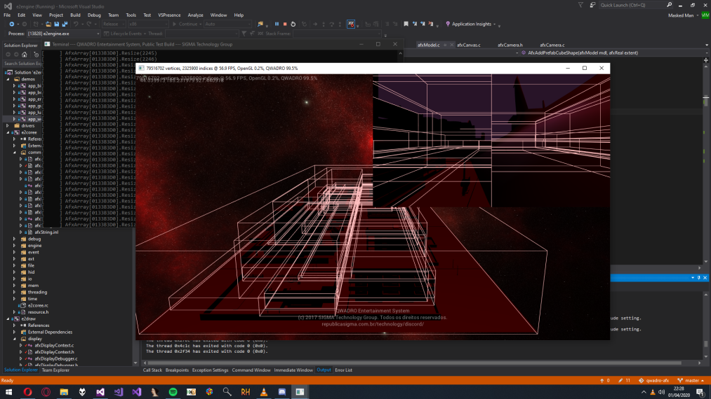
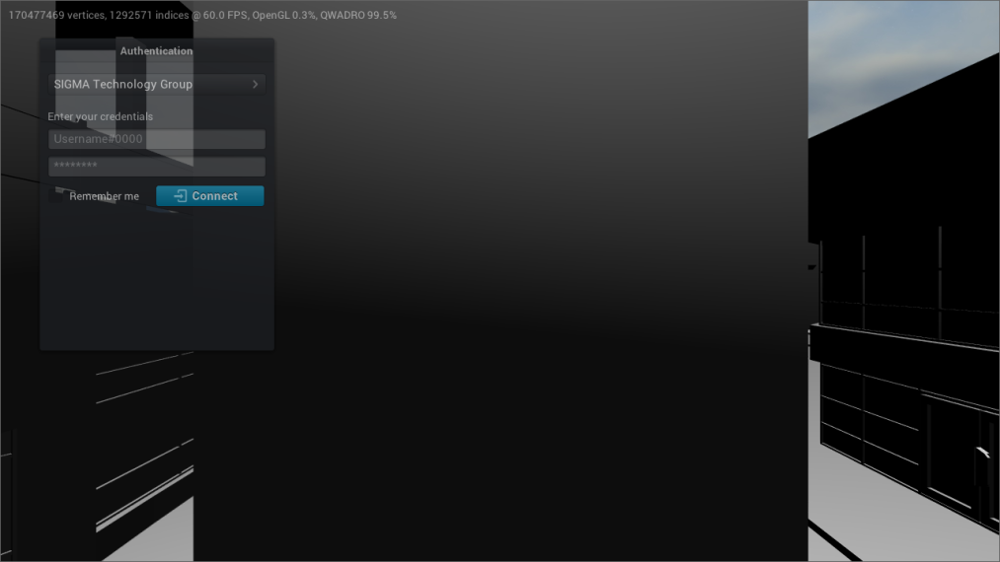
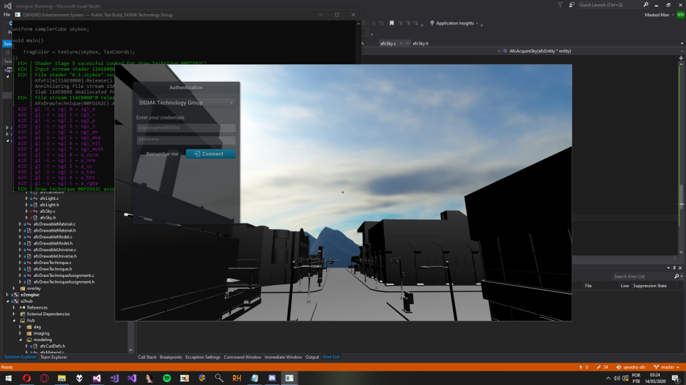
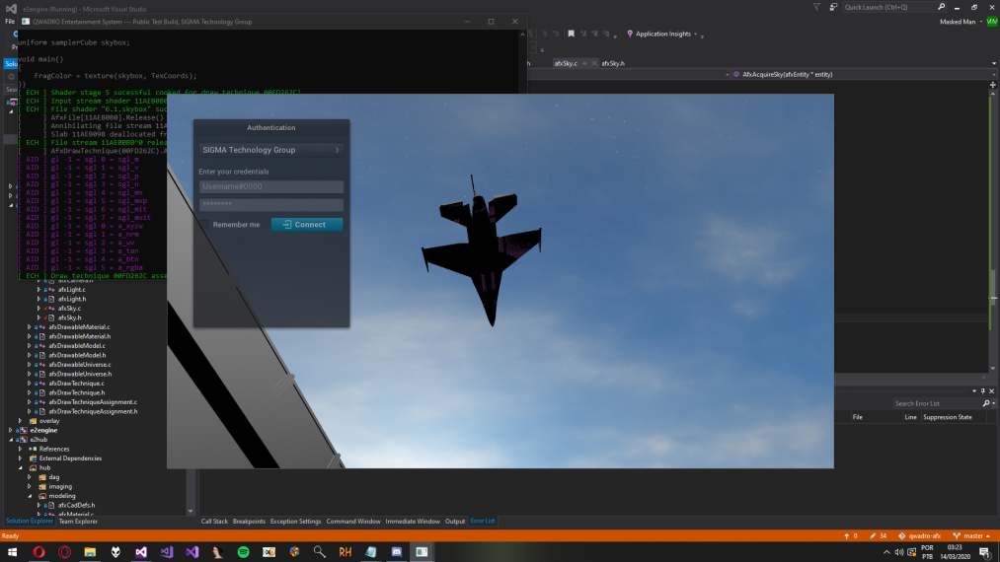
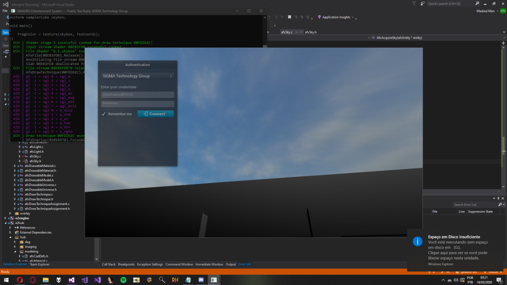

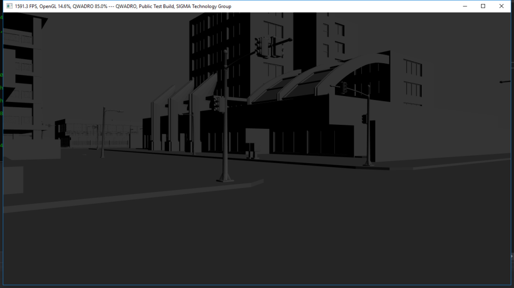
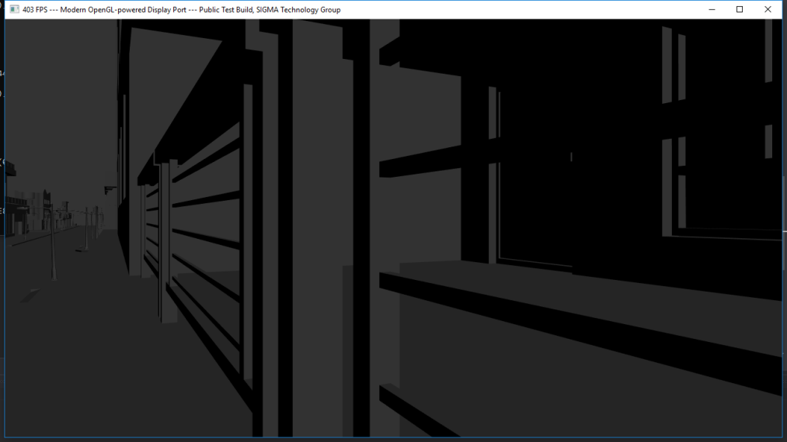
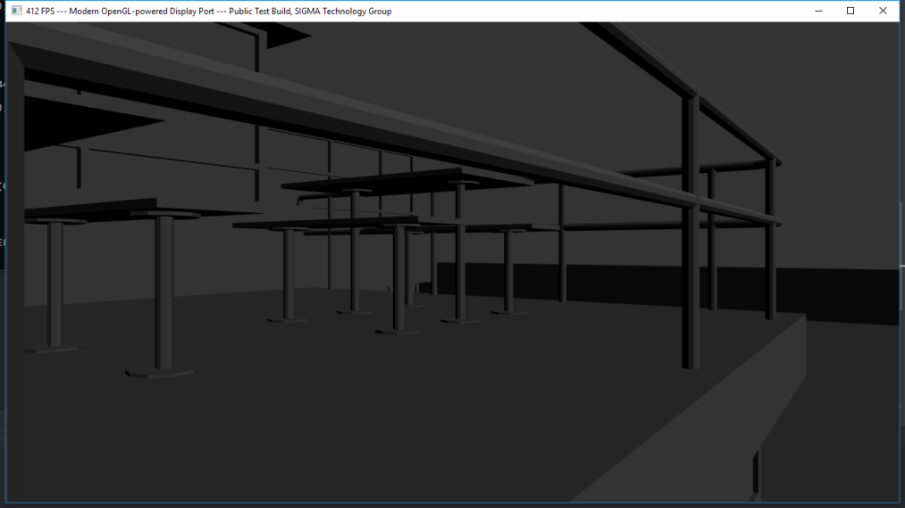
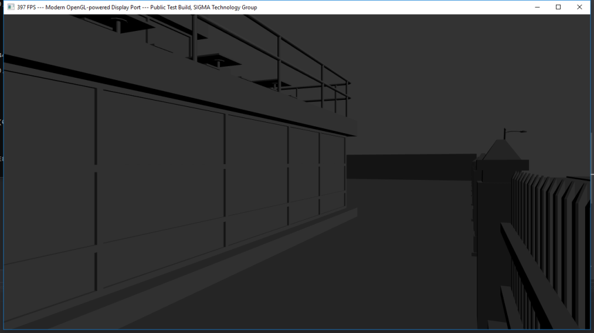
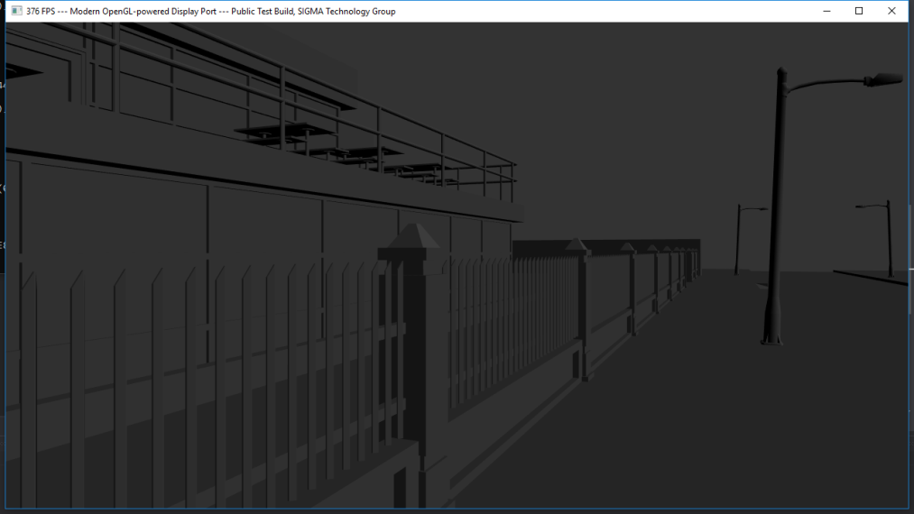
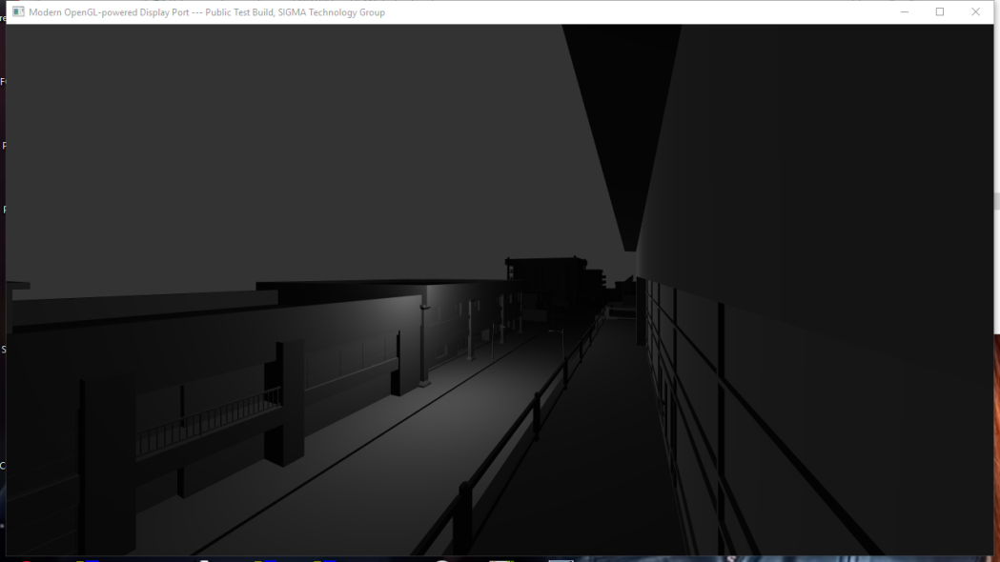
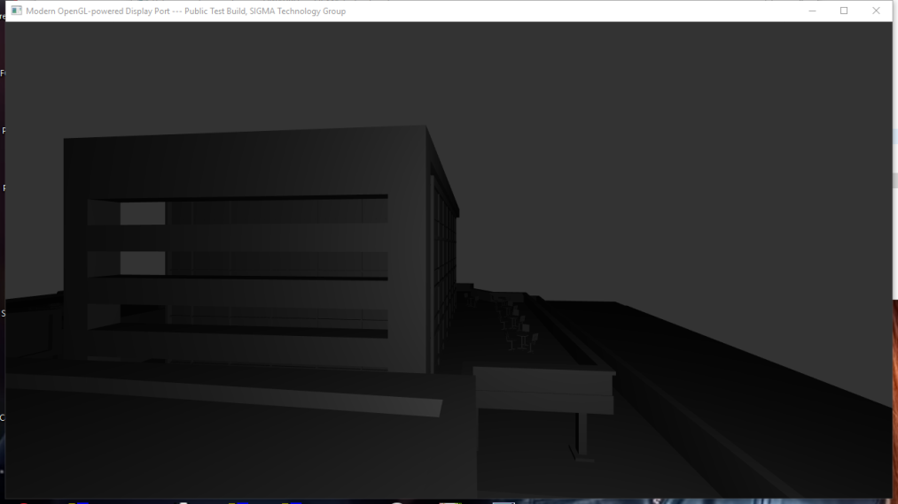

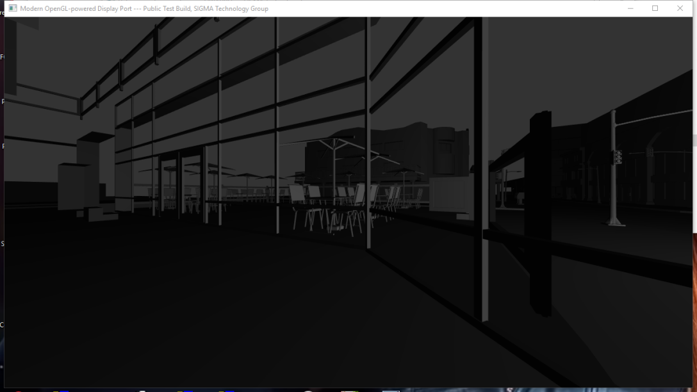
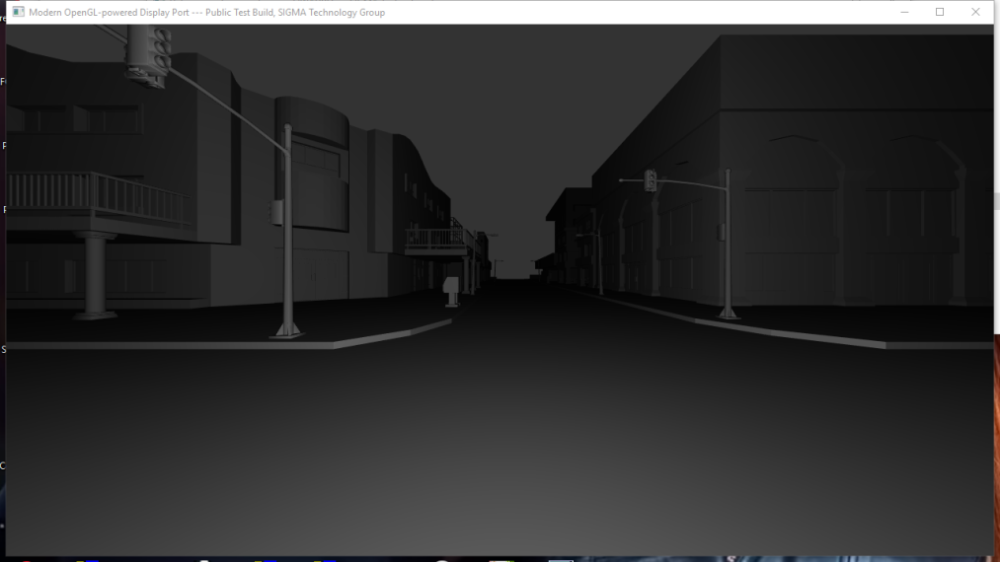
.png)
.png)
.png)
.png)
.png)
.png)
.png)
.png)
.png)
.png)
.png)
.png)
.png)
.png)
.png)
.png)
.png)
.png)
.png)
.png)
.png)
.png)
.png)
.png)
.png)
.png)
.png)
.png)
.png)
.png)
